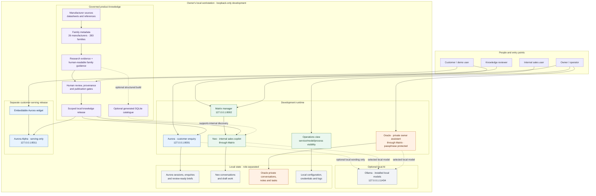
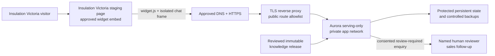

# Local-first insulation enquiry platform

**SLT discussion visual | Repository architecture and decision boundaries**

The repository is a local-first prototype for insulation product enquiries and
internal support. It brings together a governed product-knowledge workflow,
three deliberately separate assistants, and an optional customer-serving
release. The diagram shows logical boundaries; the local ports are the current
development layout, not a public or production deployment.

## How to read this

- **One repository, separate roles.** Aurora handles customer discovery;
  Neo supports internal sales; Oracle is owner-private. Their prompts,
  endpoints, conversation stores and access controls remain distinct.
- **Evidence is not approval.** Family identity and research help internal
  discovery. Customer-facing technical claims require applicable reviewed
  evidence. Extracted documents, model output and a populated catalogue are
  not approval or installation advice.
- **AI is optional and local.** Installed Ollama models may support wording or
  assistant conversation. They do not approve evidence, select products for
  customers, or replace deterministic routing and policy.
- **Alpha is a separate release boundary.** Its serving-only package contains
  Aurora, not Matrix, Neo, Oracle, owner data or local model weights.
- **Data stays on the workstation in this setup.** The development services,
  local model API and owner tools bind to loopback. The diagram does not
  represent an internet-facing or multi-user deployment.

## Current capability and limits

| In scope today | Explicitly not implied |
| --- | --- |
| Local product-family knowledge across 26 manufacturers and 283 families | Every family has complete or independently approved evidence |
| Customer-led enquiry capture and review-ready local briefs | Automatic product recommendation, stock confirmation or order placement |
| Internal Neo support with grounded product evidence and a transient pricing calculator | Oracle-private data exposed to Neo, Aurora or Alpha |
| Private Oracle workspace for owner notes, tasks and local-source search | A hosted AI service, shared cloud workspace or cross-device vault |
| Local operations visibility and serving-only Aurora package | Public production readiness, compliance determination or installation approval |

## Suggested SLT discussion

1. **Evidence readiness:** Which families and claims should be prioritized for
   technical review before any wider customer use?
2. **Insulation Victoria pilot:** Who owns the website, hosting, privacy,
   customer follow-up and technical operation for a limited Alpha pilot?
3. **Release gates:** What evidence, privacy, security and operational criteria
   must be met before considering a public deployment?
4. **Ownership:** Who is accountable for source freshness, review decisions,
   local backups and release approval?

**Decision requested:** agree the evidence-review priorities and nominate the
owners for pilot scope and release gates.

## Proposed Alpha deployment: Insulation Victoria

This is a deployment proposal, not a statement that a public site, host, DNS
entry, TLS certificate or production release is configured. The current Alpha
is a pinned, serving-only package on loopback for local staging. Public hosting
and TLS remain owner-controlled deployment work. Engineering packaging and
deployment procedures are documented in the
[local deployment runbook](LOCAL_DEPLOYMENT.md).

### Recommended first deployment shape

Start with an **isolated HTTPS hostname** (for example,
`aurora.insulationvictoria.com.au`, subject to domain-owner approval) and embed
its widget on an owner-controlled Insulation Victoria staging page. Put a
self-hosted TLS reverse proxy in front of the serving-only FastAPI process;
keep the application on loopback or a private network. This is easier to
isolate and roll back than changing the existing website's application stack.
Use a same-domain path only if the website owner confirms the hosting platform
supports a narrowly scoped reverse proxy and it materially improves the
customer experience. Do not expose the application server directly to the
internet.

The cross-origin widget supports an external website host: the chat frame
stays on the Aurora host, the site's exact HTTPS origin is allowlisted, and a
short-lived capability is scoped to one site and conversation. This capability
is **not customer identity authentication**. Never send a privileged API key
to the browser.

### Cloud host, WordPress plugin and separate build

The intended website is WordPress with WooCommerce. Use a thin, owner-reviewed
plugin only to embed the widget on approved pages; keep chat UI, session
handling and customer records on the isolated Aurora hostname. The plugin may
pass a minimal page hint, but must not send account, cart, checkout, order,
payment, stock or pricing data. It must contain no API secret, model endpoint
credential or privileged Aurora capability.

Google Compute Engine in Sydney is a **candidate to price, not an approved or
provisioned host**. Alpha 1 remains deterministic and model-free as specified
above. If a later release is approved to use a hosted model, keep inference on
the private host network or loopback behind the Aurora API; never expose Ollama
or another model server directly to the internet, and do not add a public model
selector. Whether the application and model share one VM or use separate
private services is not decided; compare both only after capacity and security
requirements are written down.

Keep four artifacts and responsibilities separate:

1. **Source repository:** private, reviewed application source and tests. It is
   not a production deployment directory.
2. **Release build:** an immutable serving-only package pinned to an approved
   knowledge-release ID, with a recorded manifest and hashes. Exclude local
   models, owner/admin assistants, source workbooks, scratch files, private
   state and credentials.
3. **Cloud runtime:** the owner-controlled host, TLS/reverse-proxy config,
   private state/backups, monitoring and any separately approved inference
   service. Inject secrets through protected host configuration, never Git or
   the browser.
4. **Website plugin:** versioned WordPress integration that embeds the
   cross-origin widget and contains no serving backend or model runtime.

Before selecting the host, obtain a full Sydney-region quote including GPU and
CPU/RAM instance costs, persistent disk, snapshots/backups, network egress,
monitoring, taxes and operational coverage. The requested A$500/month ceiling
has not been reconciled with a warm GPU available 24/7; treat that combination
as **unproven and no-go** until a written quote and capacity test show it fits.
Do not silently substitute a cold-start, spot/preemptible or intermittently
available model for the 24/7 requirement. Confirm region/data-residency,
quota/GPU availability, security ownership and rollback before provisioning.

### Phases and go/no-go gates

| Phase | Work | Exit gate |
| --- | --- | --- |
| **0. Confirm ownership and hosting** | Name Insulation Victoria business, website, privacy, operations and sales-review owners; confirm domain, staging URL, host, hosting boundary and follow-up process. Select a dedicated hostname or document why same-domain routing is preferred. For the GCE candidate, confirm Sydney quota, architecture, 24/7 capacity and complete cost against the A$500/month ceiling before creating resources. | Named accountable owners, approved architecture/data-handling decision and written budget/capacity approval. |
| **1. Approve content and behaviour** | Review claims and citations in the exact candidate release; identify the family evidence approved for public use. Agree greeting, one-question-at-a-time intake, unknown/skip, correction handling, escalation, optional contact consent, privacy notice and retention. | Named human reviewer approves the release scope and customer-facing copy; no unsupported claims, automatic recommendation or suitability promise. |
| **2. Build the public package** | Build a new allowlisted serving package from an explicitly activated release; inspect its manifest, dependency tree and route inventory. Exclude Matrix, Neo, Oracle, authoring/research tools, private sources, local models, databases and credentials. Keep model selection and local model calls off. | Clean package and route audit; immutable package and release IDs recorded. |
| **3. Secure the host boundary** | Deploy on an owner-controlled host with HTTPS, reverse proxy, trusted forwarded-header configuration, request size/time limits, origin allowlisting, rate limits, server-side validation, persistent private state, restricted service account, protected backups and monitoring. Inject secrets through protected host configuration. | Tests prove no direct app-port exposure, browser secret, public admin/operator/research route, source file or database exposure. |
| **4. Integrate on staging** | Add the widget loader to an approved staging page. Configure exact staging origins and site branding/privacy/consent text. Start with minimal page context; enable product-page hints only after validating fields and customer-facing relevance. Exclude account, cart, checkout, order, payment, stock and private customer context. | Staging tests pass on mobile and desktop for loading, retry, new enquiry, origin rejection, session isolation, accessibility and safe page-context handling. |
| **5. Run a limited pilot** | Use named human reviewers and follow-up owners. Measure aggregate widget/API failures, completion and handoff, escalations, question count and drop-off. Review unknowns and human outcomes to prioritize evidence work. | Business owner accepts pilot results, support process, privacy/retention behaviour and rollback rehearsal; no unresolved critical security, privacy or evidence issue. |
| **6. Production cutover and operate** | Approve production DNS/TLS and configuration, deploy the verified package, smoke-test health, widget and consented record creation, and monitor. Retain the last accepted package for rollback; preserve knowledge withdrawal history. | Recorded go/no-go, operational coverage and withdrawal-safe rollback confirmed. |

### Alpha scope

**Alpha 1 — limited pilot:** embedded responsive widget, approved explanations,
customer-led discovery, consented review-required enquiry records, safe
citations, human follow-up and basic operational monitoring. Do not add CRM,
automatic email, pricing/availability, orders or automatic product selection.
The UI should provide clear loading and failure states, retry and a
start-new-enquiry action. Any mock email preview is demonstration-only and is
not required for the first pilot.

Capture only what is needed for sales review: conversation reference, optional
page hint, stated problem, building area, priority, project stage, construction
details, location, requirements, unknown fields, escalation flags, consent and
contact details only when voluntarily provided. Define privacy notice, access,
retention, deletion and backup-archive retention with the site owner before
collecting real customer details. Current local retention defaults are not
automatically an approved public-site policy.

Start with privacy-minimised aggregate operational measures. Transcript
analysis, customer profiling and expanded analytics require separate approval
and retention rules; the proposed business metrics are not all established as
production monitoring in this repository.

**Alpha 2 — evidence-led enhancement:** validated product-page context,
approved source links, reviewer labels and privacy-approved aggregate
analytics. Add WooCommerce product-ID lookup only after its data contract is
approved and tests show that page metadata cannot be treated as proof of
product identity or suitability.

**Later, separately approved:** CRM, pricing/availability, quotes,
account-aware context or automated follow-up. Each requires its own consent,
security, data-retention, human-approval and rollback review.

### Repository-specific deployment gates

1. **Serving-only does not by itself mean “widget routes only.”** The current
   deployment runbook notes that some private operator APIs remain in the
   runtime. Remove/disable them in a separately tested public package, or deny
   them explicitly at the reverse proxy and prove the public route allowlist
   with automated checks. Do not rely on the UI hiding these routes.
2. **The checked-in site config is synthetic local-demo configuration.** It
   includes development values and loopback/test origins. Do not copy it into
   a public deployment. Create a separate owner-controlled Insulation Victoria
   configuration with exact HTTPS origins and approved privacy/consent
   content; inject secrets outside Git.
3. **The widget capability is not customer authentication.** It scopes access
   to a site and conversation but does not prove a person's identity or replace
   abuse controls, privacy notices, consent or rate limiting.
4. **Public host readiness is unverified.** No Insulation Victoria DNS, hosting
   access, TLS, reverse proxy, firewall, backup target or operational
   credentials have been supplied. Measure performance, persistence, failure
   recovery and monitoring on the selected host before launch.
5. **Rollback must preserve withdrawals.** Roll back code only with a
   compatible accepted knowledge release; never restore an old snapshot in a
   way that republishes a withdrawn claim.

**SLT decisions to start Phase 0:** appoint the Insulation Victoria website and
business owners, privacy/data-retention decision-maker, technical operations
owner, content reviewer and sales-follow-up owner; agree initial family/content
scope and pilot success measures; confirm the domain and whether a dedicated
hostname is acceptable. Public deployment remains **no-go** until content,
privacy, route-exposure and host-readiness gates are evidenced. This document
describes the current repository architecture and a proposed deployment path;
it is not a production-readiness claim.
